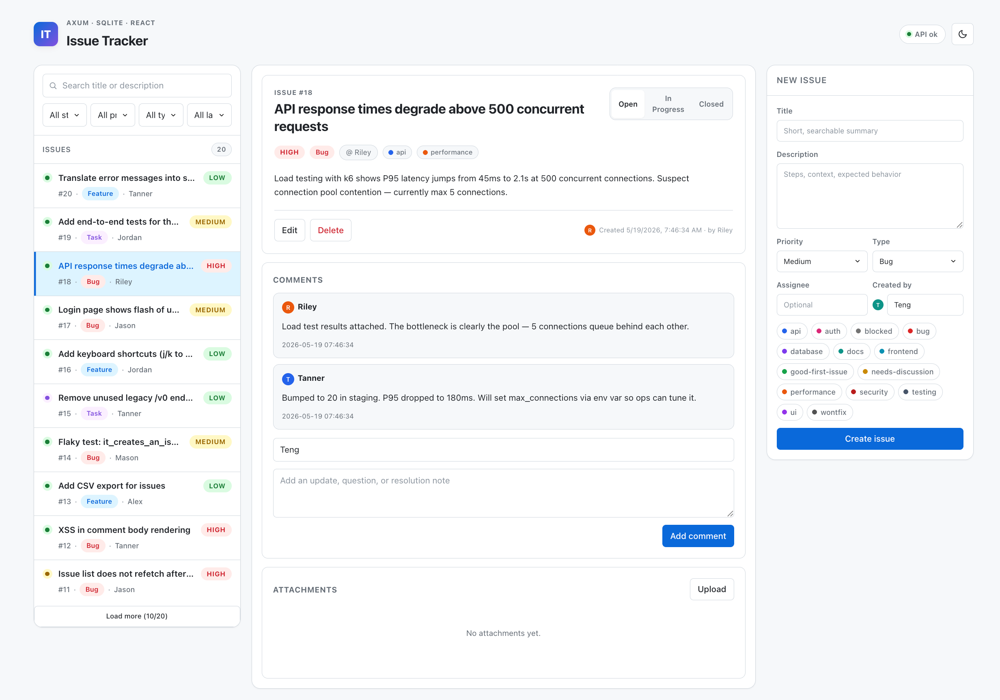
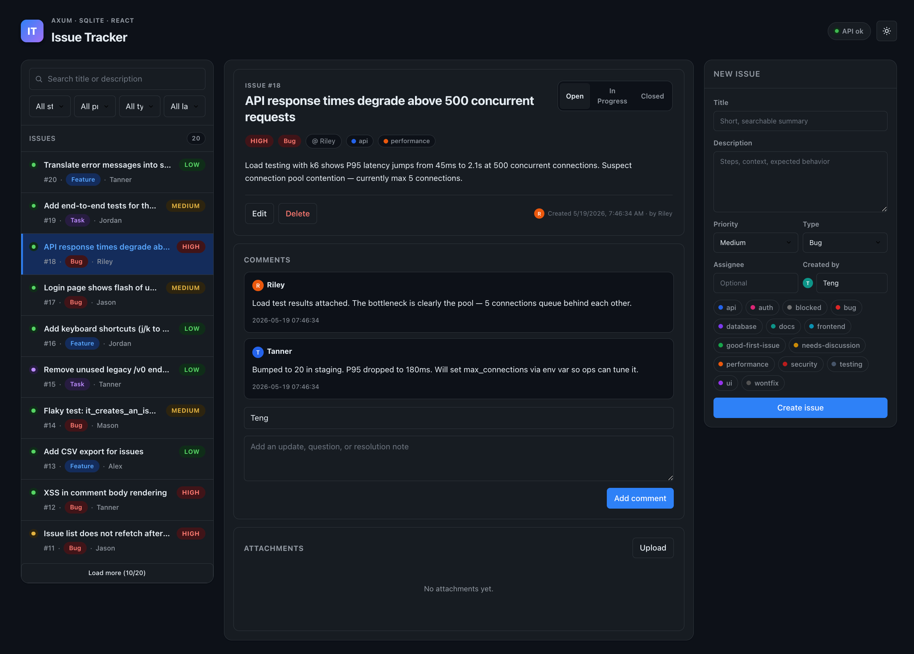

# Rust Learning Project

这是我的 Rust 学习仓库。仓库已经整理成一个 Cargo workspace：主要学习代码在
[`main/src`](main/src)，小项目在 [`main/projects`](main/projects)。


# Rust 后端开发手册

> 18 个文档，覆盖从语言基础到生产部署的完整路径。
> 面向有其他语言经验、初学 Rust 后端开发的工程师。

---

## 文档地图

```
rust_cookbook/
│
├── 语言基础（先打好地基）
│   ├── rust_concepts.md          核心概念：所有权/借用/生命周期/trait/泛型/并发
│   ├── rust_type_system.md       类型系统精讲：struct/enum/trait/impl 全套
│   └── datastructure_tips.md     数据结构实用技巧：Vec/HashMap/迭代器等 75 则
│
└── business/（业务开发专题）
    │
    ├── 序列化与错误（地基）
    │   ├── serde_in_practice.md          JSON 序列化完整指南
    │   └── error_handling_in_practice.md 错误处理：thiserror + anyhow + HTTP 响应
    │
    ├── 运行时
    │   └── async_tokio_patterns.md       Tokio 异步模式：并发/Channel/死锁/关闭
    │
    ├── HTTP 层
    │   ├── web_api_axum.md               axum 路由/提取器/中间件/完整示例
    │   ├── validation.md                 请求校验：validator + axum 集成
    │   └── auth.md                       认证：JWT + 密码哈希 + RBAC
    │
    ├── 数据层
    │   ├── database_sqlx.md              SQLx：连接池/查询/事务/迁移
    │   └── redis.md                      Redis：缓存/Session/分布式锁/限流
    │
    ├── 集成
    │   ├── http_client.md                reqwest：调外部 API/重试/并发
    │   └── background_jobs.md            后台任务：定时/队列/优雅关闭
    │
    ├── 工程化
    │   ├── config_logging_testing.md     配置管理 + 结构化日志 + 测试体系
    │   ├── observability.md              健康检查 + Prometheus 指标
    │   ├── deployment.md                 Docker + docker-compose + CI/CD
    │   └── api_docs.md                   utoipa + Swagger UI 自动生成文档
    │
    └── 设计
        └── business_patterns.md          业务设计模式：Newtype/状态机/Builder
```

---

## 推荐阅读路径

### ⚡ 快速通道（已有其他语言经验，急着上手）

只看这 6 个，能写出第一个能跑的业务接口：

```
1. rust_concepts.md                   → 理解所有权，避开编译器报错
2. business/serde_in_practice.md      → JSON 进出
3. business/error_handling_in_practice.md → ? 运算符和错误处理
4. business/async_tokio_patterns.md   → async/await 心智模型
5. business/web_api_axum.md           → 写第一个 HTTP 接口
6. business/database_sqlx.md          → 连数据库
```

---

### 📚 完整路径（建议顺序）

#### 第一阶段：语言地基（必读）

| # | 文件 | 核心内容 | 建议时间 |
|:-:|------|---------|:-------:|
| 1 | [`rust_concepts.md`](rust_concepts.md) | 所有权·借用·生命周期·trait·智能指针·async 基础 | 3-4h |
| 2 | [`rust_type_system.md`](rust_type_system.md) | struct/enum/trait/impl 的所有写法和协作方式 | 2-3h |
| 3 | [`datastructure_tips.md`](datastructure_tips.md) | Vec/HashMap/迭代器实用技巧 75 则 | 随用随查 |

> **关键点**：第 1、2 篇必须认真读，是后续所有内容的基础。
> 第 3 篇当字典用，遇到不熟悉的方法来查即可。

---

#### 第二阶段：业务核心（最高频使用）

| # | 文件 | 核心内容 |
|:-:|------|---------|
| 4 | [`business/serde_in_practice.md`](business/serde_in_practice.md) | rename/skip/default/flatten；枚举 4 种 JSON 表示；Option 三种情况 |
| 5 | [`business/error_handling_in_practice.md`](business/error_handling_in_practice.md) | 错误分层；HTTP 错误响应；`?` 的工作原理 |
| 6 | [`business/async_tokio_patterns.md`](business/async_tokio_patterns.md) | join!/select!/JoinSet；Mutex 死锁根因；spawn_blocking |

> 这三篇会在之后每篇文章里反复被用到，先吃透再往下走。

---

#### 第三阶段：HTTP 接口

| # | 文件 | 核心内容 |
|:-:|------|---------|
| 7 | [`business/web_api_axum.md`](business/web_api_axum.md) | 路由·提取器·State·中间件·统一响应 |
| 8 | [`business/validation.md`](business/validation.md) | ValidatedJson 提取器；422 错误格式 |
| 9 | [`business/auth.md`](business/auth.md) | JWT 中间件；密码哈希；Refresh Token |

---

#### 第四阶段：数据层

| # | 文件 | 核心内容 |
|:-:|------|---------|
| 10 | [`business/database_sqlx.md`](business/database_sqlx.md) | query!/query_as!；事务；迁移；批量操作 |
| 11 | [`business/redis.md`](business/redis.md) | 缓存；Session；分布式锁；限流 |

---

#### 第五阶段：外部集成

| # | 文件 | 核心内容 |
|:-:|------|---------|
| 12 | [`business/http_client.md`](business/http_client.md) | reqwest；重试退避；并发限速 |
| 13 | [`business/background_jobs.md`](business/background_jobs.md) | 定时任务；任务队列；优雅关闭 |

---

#### 第六阶段：上生产前必读

| # | 文件 | 核心内容 |
|:-:|------|---------|
| 14 | [`business/config_logging_testing.md`](business/config_logging_testing.md) | 分层配置；结构化日志；集成测试；DB 测试隔离 |
| 15 | [`business/observability.md`](business/observability.md) | /health + /ready；Prometheus 指标；请求 ID 追踪 |
| 16 | [`business/deployment.md`](business/deployment.md) | 多阶段 Dockerfile；docker-compose；GitHub Actions |
| 17 | [`business/api_docs.md`](business/api_docs.md) | utoipa 注解；Swagger UI 集成 |

---

#### 随时可读

| 文件 | 适合时机 |
|------|---------|
| [`business/business_patterns.md`](business/business_patterns.md) | 觉得代码设计不够优雅时；重构时 |

---

## 技术栈版本

| 类别 | Crate | 版本 |
|------|-------|:----:|
| Web 框架 | [axum](https://github.com/tokio-rs/axum) | 0.7 |
| 异步运行时 | [tokio](https://github.com/tokio-rs/tokio) | 1 |
| 序列化 | [serde](https://github.com/serde-rs/serde) + [serde_json](https://github.com/serde-rs/json) | 1 |
| 数据库 | [sqlx](https://github.com/launchbadge/sqlx) | 0.7 |
| 缓存 | [deadpool-redis](https://github.com/bikeshedder/deadpool) / [redis](https://github.com/redis-rs/redis-rs) | 0.16 / 0.26 |
| HTTP 客户端 | [reqwest](https://github.com/seanmonstar/reqwest) | 0.12（基于 hyper 1.0）|
| 错误处理 | [thiserror](https://github.com/dtolnay/thiserror) / [anyhow](https://github.com/dtolnay/anyhow) | 1 |
| 认证 | [jsonwebtoken](https://github.com/Keats/jsonwebtoken) / [argon2](https://github.com/RustCrypto/password-hashes/tree/master/argon2) | 9 / 0.5 |
| 校验 | [validator](https://github.com/Keats/validator) | 0.18 |
| 日志追踪 | [tracing](https://github.com/tokio-rs/tracing) / [tracing-subscriber](https://github.com/tokio-rs/tracing) | 0.1 / 0.3 |
| 指标 | [metrics](https://github.com/metrics-rs/metrics) / [metrics-exporter-prometheus](https://github.com/metrics-rs/metrics) | 0.23 / 0.15 |
| 定时任务 | [tokio-cron-scheduler](https://github.com/mvniekerk/tokio-cron-scheduler) | 0.13 |
| API 文档 | [utoipa](https://github.com/juhaku/utoipa) / [utoipa-swagger-ui](https://github.com/juhaku/utoipa) | 4 / 7 |

---

## 遇到问题速查

| 问题 | 去哪找 |
|------|-------|
| 编译器报 borrow/move 错误 | [`rust_concepts.md`](rust_concepts.md) → §1.2 所有权、§1.3 借用 |
| 不知道用 Box/Rc/Arc 哪个 | [`rust_concepts.md`](rust_concepts.md) → §4.8 智能指针选择表 |
| async 里 Mutex 死锁 | [`async_tokio_patterns.md`](business/async_tokio_patterns.md) → §五 |
| `?` 运算符报类型不匹配 | [`error_handling_in_practice.md`](business/error_handling_in_practice.md) → §六 |
| JSON 字段名转 camelCase | [`serde_in_practice.md`](business/serde_in_practice.md) → §2.1 rename |
| 枚举如何序列化成 JSON | [`serde_in_practice.md`](business/serde_in_practice.md) → §三 |
| axum Handler 返回值类型报错 | [`web_api_axum.md`](business/web_api_axum.md) → §四 统一响应 |
| 校验失败返回 422 | [`validation.md`](business/validation.md) → §四 ValidatedJson |
| JWT 接入 axum 中间件 | [`auth.md`](business/auth.md) → §三 |
| SQLx 事务怎么写 | [`database_sqlx.md`](business/database_sqlx.md) → §四 |
| Redis 实现分布式锁 | [`redis.md`](business/redis.md) → §六 |
| 后台任务如何优雅关闭 | [`background_jobs.md`](business/background_jobs.md) → §五 |
| Docker 镜像太大 | [`deployment.md`](business/deployment.md) → §一 多阶段构建 |
| 如何写集成测试 | [`config_logging_testing.md`](business/config_logging_testing.md) → 第三部分 |


## Rust vs TypeScript 对照示例

专为有 TypeScript 背景的人设计。本仓库提供了**两层** TypeScript 对照：

### 运行式对照示例

`main/examples/rust_vs_typescript/` 目录下的独立可运行示例，每个文件同时包含
Rust 实现和完整的 TypeScript 版本（注释对比）。

**快速运行（推荐）：** 使用根目录的 [`rts.sh`](rts.sh) 脚本：

```bash
./rts.sh                      # 显示所有可用主题
./rts.sh ownership_borrowing  # 运行指定主题
./rts.sh strings
```

也可以直接用 cargo：

```bash
cargo run -p learning_notes --example rts_<名称>
```

### 基础语法

| 文件 | 主题 | 运行命令 |
| --- | --- | --- |
| [`primitives.rs`](main/examples/rust_vs_typescript/primitives.rs) | 基础类型：整数（i8~i128/u8~u128）、浮点、bool、char、类型转换 | `--example rts_primitives` |
| [`variables.rs`](main/examples/rust_vs_typescript/variables.rs) | `let`/`let mut`/`const`/`static`、变量遮蔽（shadowing）、解构 | `--example rts_variables` |
| [`control_flow.rs`](main/examples/rust_vs_typescript/control_flow.rs) | `if` 表达式、`loop`（可返回值）、`while let`、`for`、范围、标签循环 | `--example rts_control_flow` |
| [`strings.rs`](main/examples/rust_vs_typescript/strings.rs) | `String` vs `&str`、切片、查找、替换、分割、字节 vs 字符 | `--example rts_strings` |

### 数据结构

| 文件 | 主题 | 运行命令 |
| --- | --- | --- |
| [`arrays.rs`](main/examples/rust_vs_typescript/arrays.rs) | 固定数组 `[T;N]` vs `Vec<T>`、增删查排序、二维数组 | `--example rts_arrays` |
| [`tuples.rs`](main/examples/rust_vs_typescript/tuples.rs) | 元组、解构、多返回值、元组结构体、复合 HashMap 键 | `--example rts_tuples` |
| [`structs.rs`](main/examples/rust_vs_typescript/structs.rs) | 结构体（对应 TS `interface`/`class`）、`impl`、更新语法、泛型结构体 | `--example rts_structs` |
| [`hashmaps.rs`](main/examples/rust_vs_typescript/hashmaps.rs) | `HashMap`、`HashSet`、`BTreeMap`、`entry` API、集合运算 | `--example rts_hashmaps` |
| [`enums.rs`](main/examples/rust_vs_typescript/enums.rs) | 枚举（对应 TS Discriminated Union）、带数据变体、`match` | `--example rts_enums` |

### 核心语义（Rust 独有概念）

| 文件 | 主题 | 运行命令 |
| --- | --- | --- |
| [`ownership_borrowing.rs`](main/examples/rust_vs_typescript/ownership_borrowing.rs) | **所有权与借用**：Move/Clone/Copy、`&`/`&mut`、借用规则（多读者或一个写者） | `--example rts_ownership_borrowing` |
| [`lifetimes.rs`](main/examples/rust_vs_typescript/lifetimes.rs) | **生命周期**：`'a` 标注、函数/结构体中的引用、省略规则、`'static` | `--example rts_lifetimes` |
| [`pattern_matching.rs`](main/examples/rust_vs_typescript/pattern_matching.rs) | **模式匹配深入**：守卫、`@` 绑定、嵌套解构、`let else`、`matches!` | `--example rts_pattern_matching` |

### 类型系统

| 文件 | 主题 | 运行命令 |
| --- | --- | --- |
| [`traits.rs`](main/examples/rust_vs_typescript/traits.rs) | Trait（对应 TS `interface`）、默认方法、泛型约束、`dyn Trait`、标准库 trait | `--example rts_traits` |
| [`generics.rs`](main/examples/rust_vs_typescript/generics.rs) | 泛型函数/结构体、trait bound、`where` 子句、关联类型、const 泛型 | `--example rts_generics` |
| [`modules.rs`](main/examples/rust_vs_typescript/modules.rs) | `mod`/`pub`/`use`（对应 TS `import`/`export`）、可见性修饰符、`pub use` 重导出 | `--example rts_modules` |

### 错误处理与安全

| 文件 | 主题 | 运行命令 |
| --- | --- | --- |
| [`option_result.rs`](main/examples/rust_vs_typescript/option_result.rs) | `Option<T>`（对应 `T \| null`）、`Result<T,E>`（对应 try/catch）、`?` 运算符 | `--example rts_option_result` |
| [`error_handling_advanced.rs`](main/examples/rust_vs_typescript/error_handling_advanced.rs) | 自定义错误枚举、`Display`/`Error` trait、`From` 转换、`Box<dyn Error>`、thiserror/anyhow 介绍 | `--example rts_error_handling_advanced` |

### 函数式编程

| 文件 | 主题 | 运行命令 |
| --- | --- | --- |
| [`closures_iter.rs`](main/examples/rust_vs_typescript/closures_iter.rs) | 闭包（对应箭头函数）、`Fn`/`FnMut`/`FnOnce`、迭代器链（map/filter/fold/zip/chain） | `--example rts_closures_iter` |

### 内存管理

| 文件 | 主题 | 运行命令 |
| --- | --- | --- |
| [`smart_pointers.rs`](main/examples/rust_vs_typescript/smart_pointers.rs) | `Box<T>`、`Rc<T>`、`RefCell<T>`、`Arc<T>`、`Mutex<T>`（对应 JS GC 自动管理） | `--example rts_smart_pointers` |

### 异步编程

| 文件 | 主题 | 运行命令 |
| --- | --- | --- |
| [`async_await.rs`](main/examples/rust_vs_typescript/async_await.rs) | `async`/`await`、tokio runtime、`join!`/`try_join!`/`spawn`、超时、Future 惰性 vs Promise 立即执行 | `--example rts_async_await` |

### 工具

| 文件 | 主题 | 运行命令 |
| --- | --- | --- |
| [`macros.rs`](main/examples/rust_vs_typescript/macros.rs) | `println!`/`format!`/`vec!`/`dbg!`/`assert!`/`todo!`、`macro_rules!` 入门 | `--example rts_macros` |

## 快速入口脚本

| 脚本 | 用途 | 示例 |
| --- | --- | --- |
| [`rts.sh`](rts.sh) | 运行 `rust_vs_typescript/` 对照示例 | `./rts.sh ownership_borrowing` |
| [`src.sh`](src.sh) | 运行 / 测试 `main/src/` 下的学习文件 | `./src.sh learning_additions/iterators` |

```bash
./rts.sh                                      # 列出所有 TS vs Rust 对照主题
./rts.sh strings                              # 运行指定对照示例

./src.sh                                      # 列出 src/ 下所有文件及其状态
./src.sh basics/if_else                       # 运行 fn main() + 所有 fn example_*
./src.sh types/array                          # 自动生成 main 依次调用 fn example_*
./src.sh learning_additions/iterators --test  # 跑 #[test] 测试
```

`src.sh` 自动判断运行方式：

| 文件特征 | 模式 |
|---------|------|
| `fn main()` | `cargo run`，同时调用同文件的 `fn example_*` |
| 只有 `fn example_*` | 自动生成 `main` 依次调用所有示例 |
| 只有 `#[test]` | `cargo test --nocapture` |
| 都没有（纯模块） | 提示在 `playground.rs` 中调用 |

## 常用命令

```bash
cargo run -p learning_notes
cargo check --workspace
cargo test --workspace
```

运行小项目：

```bash
cargo run -p minigrep
cargo run -p practice
cargo run -p issue_tracker_api
```

## 快速测试一个文件或模块

推荐使用 Cargo example。这个仓库提供了一个临时练习入口：

[`main/examples/playground.rs`](main/examples/playground.rs)

运行：

```bash
cargo run -p learning_notes --example playground
```

使用方式：

1. 打开 [`main/examples/playground.rs`](main/examples/playground.rs)。
2. `use learning_notes::...` 引入你正在看的模块。
3. 在 `main()` 里调用你想测试的函数。
4. 运行上面的 `cargo run` 命令。

这种方式比直接 `rustc file.rs` 更适合本仓库，因为它可以正常使用 crate 模块、依赖和 workspace。

如果某个 `.rs` 文件本身是完全独立的，并且里面有 `fn main()`，也可以临时这样跑：

```bash
rustc path/to/file.rs -o /tmp/rust_test && /tmp/rust_test
```

但如果文件依赖 `learning_notes` 里的其他模块，优先使用 `playground.rs`。

## 推荐学习路线

新版文件夹（按学习顺序）：

1. **[`basics/`](main/src/basics)** — 变量、控制流、方法等语言基础
2. **[`types/`](main/src/types)** + **[`base_type/`](main/src/base_type)** — 类型系统：数组、元组、泛型、数值类型
3. **[`ownership/`](main/src/ownership)** — 所有权与生命周期（Rust 最核心概念）
4. **[`structs_enums/`](main/src/structs_enums)** — 结构体、枚举、模式匹配
5. **[`traits/`](main/src/traits)** — Trait 系统
6. **[`errors/`](main/src/errors)** — 错误处理

旧版文件夹（按推荐顺序）：

7. **[`learning_additions/`](main/src/learning_additions)** — 整理后的核心示例，有测试
8. **[`collections/`](main/src/collections) / [`config/`](main/src/config) / [`utils/`](main/src/utils)** — 集合、配置、工具函数
9. **[`rust_by_example/`](main/src/rust_by_example)** — Rust by Example 风格练习
10. **[`advanced/`](main/src/advanced)** — 高级主题笔记（片段合集，不保证全编译）
11. 想看完整小项目时，进入 [`main/projects`](main/projects)。

## 核心补充示例

这些文件是后来补充的可编译学习入口，适合快速复习 Rust 重点。

| 文件 | 简介 |
| --- | --- |
| [`main/src/learning_additions/ownership_borrowing.rs`](main/src/learning_additions/ownership_borrowing.rs) | 所有权、移动、克隆、不可变借用、可变借用、字符串切片。 |
| [`main/src/learning_additions/error_handling.rs`](main/src/learning_additions/error_handling.rs) | `Option`、`Result`、`ok_or_else`、`?` 的基础错误处理流程。 |
| [`main/src/learning_additions/traits_generics.rs`](main/src/learning_additions/traits_generics.rs) | trait、泛型、trait bound、泛型函数返回最大值。 |
| [`main/src/learning_additions/iterators.rs`](main/src/learning_additions/iterators.rs) | `map`、`filter`、`fold`、`collect`、`find` 等迭代器写法。 |
| [`main/src/learning_additions/lifetimes.rs`](main/src/learning_additions/lifetimes.rs) | 生命周期标注、结构体保存引用、生命周期省略规则。 |
| [`main/src/learning_additions/pattern_matching.rs`](main/src/learning_additions/pattern_matching.rs) | `match`、匹配守卫、结构体/元组解构、`if let`。 |
| [`main/src/learning_additions/modules_and_testing.rs`](main/src/learning_additions/modules_and_testing.rs) | 模块、`pub` 可见性、私有字段、单元测试。 |
| [`main/src/learning_additions/async_basics.rs`](main/src/learning_additions/async_basics.rs) | `async fn`、`Future`、`.await` 的基础说明。 |
| [`main/src/learning_additions/collections_extra.rs`](main/src/learning_additions/collections_extra.rs) | `HashSet`、`BTreeMap`、`BTreeSet`、`VecDeque`：Vec/HashMap 之外的四个常用集合。 |
| [`main/src/learning_additions/impl_trait.rs`](main/src/learning_additions/impl_trait.rs) | `impl Trait` vs `dyn Trait`：参数位置、返回位置（RPIT）、异构集合的选择。 |
| [`main/src/learning_additions/const_generics.rs`](main/src/learning_additions/const_generics.rs) | `const fn`（编译期函数）和 const 泛型（数组长度作为类型参数）。 |
| [`main/src/learning_additions/derive_macros.rs`](main/src/learning_additions/derive_macros.rs) | `#[derive(...)]` 系统：`Debug`、`Clone`、`Copy`、`PartialEq`、`Ord`、`Hash`、`Default` 各自生成什么。 |
| [`main/src/learning_additions/option_result_combinators.rs`](main/src/learning_additions/option_result_combinators.rs) | `Option`/`Result` 组合子链式调用：`map`、`and_then`、`or_else`、`map_err`、`flatten`、`transpose` 等。 |
| [`main/src/learning_additions/serde_basics.rs`](main/src/learning_additions/serde_basics.rs) | `serde` 序列化/反序列化：derive、字段重命名、跳过字段、默认值、枚举、动态 JSON Value。 |
| [`main/src/learning_additions/testing_advanced.rs`](main/src/learning_additions/testing_advanced.rs) | 测试进阶：文档测试、`#[should_panic]`、返回 `Result` 的测试、`#[ignore]`、辅助函数。 |
| [`main/src/learning_additions/env_process.rs`](main/src/learning_additions/env_process.rs) | `std::env`（环境变量、命令行参数、当前目录）和 `std::process`（退出码）。 |
| [`main/src/learning_additions/cargo_features.rs`](main/src/learning_additions/cargo_features.rs) | Cargo features：`#[cfg(feature = "...")]`、`cfg!` 宏、平台相关编译、debug/release 区分。 |
| [`main/src/learning_additions/mod.rs`](main/src/learning_additions/mod.rs) | 核心补充示例的模块入口。 |

## 主 crate 入口

| 文件 | 简介 |
| --- | --- |
| [`main/src/main.rs`](main/src/main.rs) | `learning_notes` 的命令行入口，目前只打印学习提示。 |
| [`main/src/lib.rs`](main/src/lib.rs) | 主库入口，导出可编译的学习模块。 |
| [`main/examples/playground.rs`](main/examples/playground.rs) | 临时练习入口，用来快速调用和测试正在阅读的模块。 |
| [`main/Cargo.toml`](main/Cargo.toml) | `learning_notes` crate 配置。 |
| [`Cargo.toml`](Cargo.toml) | workspace 配置，包含主学习 crate 和两个小项目。 |

## 基础笔记

这些是早期基础学习笔记，有些是片段式记录，主要用于阅读和查找。

### 基础入门 (`basics/`)

| 文件 | 简介 |
| --- | --- |
| [`main/src/basics/variable.rs`](main/src/basics/variable.rs) | 变量、常量、可变性、遮蔽等基础概念。 |
| [`main/src/basics/if_else.rs`](main/src/basics/if_else.rs) | `if`、`else if`、条件表达式返回值。 |
| [`main/src/basics/comment.rs`](main/src/basics/comment.rs) | 注释、文档注释、测试注释示例。 |
| [`main/src/basics/formatted_output.rs`](main/src/basics/formatted_output.rs) | `println!`、格式化输出、`Debug`、`Display`。 |
| [`main/src/basics/method.rs`](main/src/basics/method.rs) | `impl`、方法、关联函数和 `self` 参数。 |

### 类型系统 (`types/` 配合 `base_type/`)

| 文件 | 简介 |
| --- | --- |
| [`main/src/types/array.rs`](main/src/types/array.rs) | 数组、切片、数组初始化和索引访问。 |
| [`main/src/types/tuple.rs`](main/src/types/tuple.rs) | 元组创建、解构和通过下标访问。 |
| [`main/src/types/compound.rs`](main/src/types/compound.rs) | 复合类型相关片段，包括数组、元组、结构体等。 |
| [`main/src/types/generics.rs`](main/src/types/generics.rs) | 泛型函数、泛型结构体和泛型约束。 |
| [`main/src/base_type/basic.rs`](main/src/base_type/basic.rs) | 数值类型、溢出、基础类型实验。 |
| [`main/src/base_type/expression.rs`](main/src/base_type/expression.rs) | 表达式、语句、返回值和发散函数。 |
| [`main/src/base_type/string_bool_unit.rs`](main/src/base_type/string_bool_unit.rs) | 字符串、布尔值、单元类型等基础类型。 |
| [`main/src/base_type/string_str_difference.rs`](main/src/base_type/string_str_difference.rs) | `String` 和 `&str` 的区别。 |
| [`main/src/base_type/iteration.rs`](main/src/base_type/iteration.rs) | 初学阶段的数组、切片、遍历、`iter_mut`、`map`、`filter` 练习。 |
| [`main/src/base_type/mod.rs`](main/src/base_type/mod.rs) | 基础类型模块入口。 |
| [`main/src/base_type/runner_notes.rs`](main/src/base_type/runner_notes.rs) | 旧 `rust-learning` main 入口笔记，保留原始学习上下文。 |

## 所有权、结构体、枚举与 Trait

### 所有权与生命周期 (`ownership/`)

| 文件 | 简介 |
| --- | --- |
| [`main/src/ownership/ownership.rs`](main/src/ownership/ownership.rs) | 所有权移动、借用、引用规则和可变引用限制。 |
| [`main/src/ownership/lifetime.rs`](main/src/ownership/lifetime.rs) | 生命周期基础、引用有效性和函数生命周期标注。 |

### 结构体、枚举与模式匹配 (`structs_enums/`)

| 文件 | 简介 |
| --- | --- |
| [`main/src/structs_enums/structs.rs`](main/src/structs_enums/structs.rs) | 结构体定义、字段、实例创建和调试输出。 |
| [`main/src/structs_enums/enums.rs`](main/src/structs_enums/enums.rs) | 枚举、`Option` 和枚举变体使用。 |
| [`main/src/structs_enums/match_basics.rs`](main/src/structs_enums/match_basics.rs) | `match`、`if let`、`Option` 解包等练习。 |
| [`main/src/structs_enums/pattern_match.rs`](main/src/structs_enums/pattern_match.rs) | 模式匹配、`Result` 风格示例和匹配语法。 |
| [`main/src/structs_enums/all_pattern.rs`](main/src/structs_enums/all_pattern.rs) | 更完整的模式匹配语法集合。 |

### Trait 系统 (`traits/`)

| 文件 | 简介 |
| --- | --- |
| [`main/src/traits/basics.rs`](main/src/traits/basics.rs) | trait 定义、实现、trait bound 和类型转换。 |
| [`main/src/traits/advanced.rs`](main/src/traits/advanced.rs) | 关联类型、默认泛型参数、运算符重载等高级 trait。 |
| [`main/src/traits/trait_objects.rs`](main/src/traits/trait_objects.rs) | trait object、动态分发和 `dyn Trait`。 |

### 错误处理 (`errors/`)

| 文件 | 简介 |
| --- | --- |
| [`main/src/errors/result_error.rs`](main/src/errors/result_error.rs) | `Result`、错误传播、文件读取和 `panic!` 相关笔记。 |

## 集合与工具模块

| 文件 | 简介 |
| --- | --- |
| [`main/src/collections/vector.rs`](main/src/collections/vector.rs) | `Vec<T>` 创建、增删改查、遍历、切片等。 |
| [`main/src/collections/hashmap.rs`](main/src/collections/hashmap.rs) | `HashMap` 创建、插入、读取、遍历和更新。 |
| [`main/src/collections/mod.rs`](main/src/collections/mod.rs) | 集合模块入口。 |
| [`main/src/utils/math.rs`](main/src/utils/math.rs) | 简单数学工具函数。 |
| [`main/src/utils/string.rs`](main/src/utils/string.rs) | 字符串工具函数。 |
| [`main/src/utils/helper.rs`](main/src/utils/helper.rs) | 辅助输出函数。 |
| [`main/src/utils/mod.rs`](main/src/utils/mod.rs) | 工具模块入口，也包含颜色混合示例。 |
| [`main/src/config/constants.rs`](main/src/config/constants.rs) | 常量配置示例。 |
| [`main/src/config/mod.rs`](main/src/config/mod.rs) | 配置模块入口。 |
| [`main/src/package_module/crate.rs`](main/src/package_module/crate.rs) | crate、module、路径和可见性笔记。 |
| [`main/src/package_module/mod.rs`](main/src/package_module/mod.rs) | package/module 笔记入口。 |

## 高级主题笔记

`main/src/advanced` 里的很多文件是原始学习笔记，包含多个独立片段。它们适合阅读，不一定全部直接编译。

| 文件 | 简介 |
| --- | --- |
| [`main/src/advanced/compiled_examples.rs`](main/src/advanced/compiled_examples.rs) | 可编译高级示例：`Rc<RefCell<T>>`、`Arc<Mutex<T>>`、`Drop`、`Deref`。 |
| [`main/src/advanced/async.rs`](main/src/advanced/async.rs) | async/await、Future 和异步执行顺序笔记。 |
| [`main/src/advanced/stream.rs`](main/src/advanced/stream.rs) | Stream、异步流、`poll_next` 概念。 |
| [`main/src/advanced/multi-futures-simultaneous.rs`](main/src/advanced/multi-futures-simultaneous.rs) | 同时等待多个 Future、`join`、`select` 等异步模式。 |
| [`main/src/advanced/concurrency_with_threads.rs`](main/src/advanced/concurrency_with_threads.rs) | 线程创建、join、move 闭包和线程基础。 |
| [`main/src/advanced/concurrency_2.rs`](main/src/advanced/concurrency_2.rs) | channel、发送者/接收者、线程间消息传递。 |
| [`main/src/advanced/concurrency_3.rs`](main/src/advanced/concurrency_3.rs) | `Mutex`、`RwLock`、`Condvar`、信号量等同步工具。 |
| [`main/src/advanced/concurrency_4.rs`](main/src/advanced/concurrency_4.rs) | 原子类型、内存顺序和低层并发基础。 |
| [`main/src/advanced/concurrency_5.rs`](main/src/advanced/concurrency_5.rs) | `Send`、`Sync`、手动 unsafe impl 的风险。 |
| [`main/src/advanced/rc_arc.rs`](main/src/advanced/rc_arc.rs) | `Rc`、`Arc`、引用计数和线程共享差异。 |
| [`main/src/advanced/weak.rs`](main/src/advanced/weak.rs) | `Weak` 引用和避免循环引用。 |
| [`main/src/advanced/cell_refcell.rs`](main/src/advanced/cell_refcell.rs) | `Cell`、`RefCell` 和内部可变性。 |
| [`main/src/advanced/smart_pointer.rs`](main/src/advanced/smart_pointer.rs) | 智能指针概念和常见用法。 |
| [`main/src/advanced/deref.rs`](main/src/advanced/deref.rs) | `Deref`、`DerefMut` 和解引用强制转换。 |
| [`main/src/advanced/drop.rs`](main/src/advanced/drop.rs) | `Drop` trait、资源释放和析构顺序。 |
| [`main/src/advanced/pin_unpin.rs`](main/src/advanced/pin_unpin.rs) | `Pin`、`Unpin`、自引用类型和移动限制。 |
| [`main/src/advanced/self-referential.rs`](main/src/advanced/self-referential.rs) | 自引用结构体的风险和处理方式。 |
| [`main/src/advanced/unsafe_superpowers.rs`](main/src/advanced/unsafe_superpowers.rs) | unsafe 五种能力：裸指针、unsafe fn、静态变量、unsafe trait、FFI。 |
| [`main/src/advanced/inline_assembly.rs`](main/src/advanced/inline_assembly.rs) | 内联汇编基础和平台相关注意点。 |
| [`main/src/advanced/converse_type.rs`](main/src/advanced/converse_type.rs) | 类型转换、裸指针、`transmute` 等底层转换。 |
| [`main/src/advanced/custom_type.rs`](main/src/advanced/custom_type.rs) | 自定义类型、类型别名和 never type 思路。 |
| [`main/src/advanced/enum_int.rs`](main/src/advanced/enum_int.rs) | 枚举和整数转换相关笔记。 |
| [`main/src/advanced/errors.rs`](main/src/advanced/errors.rs) | 高级错误处理、自定义错误类型和错误转换。 |
| [`main/src/advanced/global_variable.rs`](main/src/advanced/global_variable.rs) | 全局变量、静态变量、原子计数和 lazy 初始化。 |
| [`main/src/advanced/iterator.rs`](main/src/advanced/iterator.rs) | 自定义迭代器、消费适配器和迭代器适配器。 |
| [`main/src/advanced/lifetime.rs`](main/src/advanced/lifetime.rs) | 高级生命周期、无界生命周期和生命周期约束。 |
| [`main/src/advanced/closure.rs`](main/src/advanced/closure.rs) | 闭包捕获、`Fn`/`FnMut`/`FnOnce` 和返回闭包。 |
| [`main/src/advanced/macro.rs`](main/src/advanced/macro.rs) | 声明宏、过程宏概念和宏展开。 |
| [`main/src/advanced/sized.rs`](main/src/advanced/sized.rs) | `Sized`、动态大小类型和 `?Sized`。 |
| [`main/src/advanced/mod.rs`](main/src/advanced/mod.rs) | 高级主题模块说明和可编译示例入口。 |

## Rust by Example 练习

这些是从旧 `rust-examples` 整理过来的练习。

| 文件 | 简介 |
| --- | --- |
| [`main/src/rust_by_example/examples/primitives.rs`](main/src/rust_by_example/examples/primitives.rs) | 原始类型、字面量、元组、数组和切片。 |
| [`main/src/rust_by_example/examples/variable_binding.rs`](main/src/rust_by_example/examples/variable_binding.rs) | 变量绑定、作用域、遮蔽和可变性。 |
| [`main/src/rust_by_example/examples/variable_types.rs`](main/src/rust_by_example/examples/variable_types.rs) | 类型推断、类型别名和转换。 |
| [`main/src/rust_by_example/examples/conversion.rs`](main/src/rust_by_example/examples/conversion.rs) | `From`、`Into`、`TryFrom`、字符串解析。 |
| [`main/src/rust_by_example/examples/expression.rs`](main/src/rust_by_example/examples/expression.rs) | 表达式和语句区别。 |
| [`main/src/rust_by_example/examples/flow_control.rs`](main/src/rust_by_example/examples/flow_control.rs) | `if`、`loop`、`while`、`for`、`match` 流程控制。 |
| [`main/src/rust_by_example/examples/match_test.rs`](main/src/rust_by_example/examples/match_test.rs) | match 匹配、守卫、绑定和解构。 |
| [`main/src/rust_by_example/examples/test_function.rs`](main/src/rust_by_example/examples/test_function.rs) | 函数、方法、闭包和发散函数。 |
| [`main/src/rust_by_example/examples/closures.rs`](main/src/rust_by_example/examples/closures.rs) | 闭包捕获、作为参数、作为返回值。 |
| [`main/src/rust_by_example/examples/structs.rs`](main/src/rust_by_example/examples/structs.rs) | 结构体、元组结构体和枚举使用。 |
| [`main/src/rust_by_example/examples/struct_visit.rs`](main/src/rust_by_example/examples/struct_visit.rs) | 模块可见性和访问控制。 |
| [`main/src/rust_by_example/examples/test_mod.rs`](main/src/rust_by_example/examples/test_mod.rs) | 模块路径、`pub`、`super`、`self`。 |
| [`main/src/rust_by_example/examples/list.rs`](main/src/rust_by_example/examples/list.rs) | 用枚举和 `Box` 实现链表。 |
| [`main/src/rust_by_example/examples/print_debug.rs`](main/src/rust_by_example/examples/print_debug.rs) | `Debug` 格式化输出。 |
| [`main/src/rust_by_example/examples/print_display.rs`](main/src/rust_by_example/examples/print_display.rs) | `Display` trait 和自定义格式化。 |
| [`main/src/rust_by_example/examples/test_print.rs`](main/src/rust_by_example/examples/test_print.rs) | `println!`、位置参数、命名参数和格式化。 |
| [`main/src/rust_by_example/examples/constants.rs`](main/src/rust_by_example/examples/constants.rs) | 常量和静态变量。 |
| [`main/src/rust_by_example/examples/attribute.rs`](main/src/rust_by_example/examples/attribute.rs) | 属性、条件编译和 lint 控制。 |
| [`main/src/rust_by_example/examples/basic_cargo.rs`](main/src/rust_by_example/examples/basic_cargo.rs) | Cargo 基础说明。 |
| [`main/src/rust_by_example/examples/mod.rs`](main/src/rust_by_example/examples/mod.rs) | Rust by Example 示例模块入口。 |
| [`main/src/rust_by_example/std_types/my_vectors.rs`](main/src/rust_by_example/std_types/my_vectors.rs) | 标准库 `Vec` 练习。 |
| [`main/src/rust_by_example/std_types/my_box.rs`](main/src/rust_by_example/std_types/my_box.rs) | 标准库 `Box` 练习。 |
| [`main/src/rust_by_example/std_types/mod.rs`](main/src/rust_by_example/std_types/mod.rs) | 标准类型练习模块入口。 |
| [`main/src/rust_by_example/mod_split/split.rs`](main/src/rust_by_example/mod_split/split.rs) | 多文件模块拆分示例。 |
| [`main/src/rust_by_example/mod_split/my.rs`](main/src/rust_by_example/mod_split/my.rs) | 子模块入口示例。 |
| [`main/src/rust_by_example/mod_split/rary.rs`](main/src/rust_by_example/mod_split/rary.rs) | library 风格模块示例。 |
| [`main/src/rust_by_example/runner_notes.rs`](main/src/rust_by_example/runner_notes.rs) | 旧 runner 入口笔记，记录如何手动调用示例。 |
| [`main/src/rust_by_example/mod.rs`](main/src/rust_by_example/mod.rs) | Rust by Example 总入口。 |

## 其他练习与旧笔记

| 文件 | 简介 |
| --- | --- |
| [`main/src/practice_core/core/array.rs`](main/src/practice_core/core/array.rs) | 数组练习。 |
| [`main/src/practice_core/core/string.rs`](main/src/practice_core/core/string.rs) | 字符串创建、拼接、切片和遍历。 |
| [`main/src/practice_core/core/vector.rs`](main/src/practice_core/core/vector.rs) | vector 常用操作练习。 |
| [`main/src/practice_core/core/hashmap.rs`](main/src/practice_core/core/hashmap.rs) | hashmap、serde 序列化和反序列化练习。 |
| [`main/src/practice_core/core/json.md`](main/src/practice_core/core/json.md) | JSON 操作笔记。 |
| [`main/src/practice_core/core/runner_notes.rs`](main/src/practice_core/core/runner_notes.rs) | core practice 旧入口笔记。 |
| [`main/src/practice_core/core/mod.rs`](main/src/practice_core/core/mod.rs) | core practice 模块入口。 |
| [`main/src/practice_core/mod.rs`](main/src/practice_core/mod.rs) | practice core 总入口。 |

## 小项目

| 文件 | 简介 |
| --- | --- |
| [`main/projects/minigrep/src/lib.rs`](main/projects/minigrep/src/lib.rs) | minigrep 核心逻辑：参数解析、搜索、大小写敏感/不敏感。 |
| [`main/projects/minigrep/src/main.rs`](main/projects/minigrep/src/main.rs) | minigrep 当前运行入口，现在启动 mini web server。 |
| [`main/projects/minigrep/src/mini_web_server.rs`](main/projects/minigrep/src/mini_web_server.rs) | async-std 写的简单 HTTP server 和测试用 mock stream。 |
| [`main/projects/minigrep/src/hello.html`](main/projects/minigrep/src/hello.html) | mini web server 的成功响应 HTML。 |
| [`main/projects/minigrep/src/404.html`](main/projects/minigrep/src/404.html) | mini web server 的 404 响应 HTML。 |
| [`main/projects/minigrep/Cargo.toml`](main/projects/minigrep/Cargo.toml) | minigrep 项目配置。 |
| [`main/projects/hacker_news/src/main.rs`](main/projects/hacker_news/src/main.rs) | Hacker News API 练习入口，把请求结果写入 JSON。 |
| [`main/projects/hacker_news/src/hacker_news.rs`](main/projects/hacker_news/src/hacker_news.rs) | Hacker News 请求和数据结构。 |
| [`main/projects/hacker_news/src/bak.rs`](main/projects/hacker_news/src/bak.rs) | 备用/历史实验代码。 |
| [`main/projects/hacker_news/data.json`](main/projects/hacker_news/data.json) | API 请求保存下来的示例数据。 |
| [`main/projects/hacker_news/Cargo.toml`](main/projects/hacker_news/Cargo.toml) | Hacker News practice 项目配置。 |

## Issue Tracker 全栈项目

这是一个更完整的 Axum + Tokio + SQLite + React 学习项目：

```text
main/projects/issue_tracker_api
main/projects/issue_tracker_web
```




### 快速启动

**第一步：初始化数据库**（仅第一次运行需要）

```bash
cd main/projects/issue_tracker_api
./scripts/reset_dev_db.sh
cd ../../../..   # 回到 workspace 根目录
```

**第二步：启动后端**

```bash
cargo run -p issue_tracker_api
# 或热重载开发（需先安装 cargo-watch）
./watch.sh api
```

后端启动后监听：`http://127.0.0.1:3001`

所有 API 请求需携带请求头：`x-api-key: dev-secret`

**第三步：启动前端**（新开一个终端）

```bash
cd main/projects/issue_tracker_web
npm install      # 首次运行需要
npm run dev
```

前端启动后访问：`http://127.0.0.1:5173`

---

后端覆盖：

- Axum 路由、handler、extractor
- Tokio async runtime
- SQLx + SQLite（动态 QueryBuilder、事务）
- JSON CRUD（camelCase 请求/响应，DTO 分离）
- 分页查询（limit/offset + total 计数）
- comments / labels
- multipart 文件上传
- 文件下载
- CORS、request id、tracing、API key middleware
- 统一 JSON error response
- 声明式请求校验（validator crate）
- 单元测试 + HTTP 集成测试（tower::ServiceExt）

前端覆盖：

- React + Vite + TypeScript
- issue 创建、列表、筛选、详情编辑
- close / reopen / in progress 状态流转
- 评论提交
- 附件上传、下载、删除
- loading / error 状态

### 运行测试

**单元测试 + 集成测试**（不依赖外部服务，使用 `:memory:` SQLite）：

```bash
cargo test -p issue_tracker_api          # 全部测试
cargo test -p issue_tracker_api -- --nocapture  # 查看 println 输出
```

**端到端 API 测试**（需要后端正在运行 + `jq`）：


```bash
./main/projects/issue_tracker_api/scripts/test_api.sh
```

自定义地址或 API key：

```bash
BASE=http://127.0.0.1:3001 API_KEY=dev-secret ./main/projects/issue_tracker_api/scripts/test_api.sh
```

脚本覆盖所有 17 个端点，按以下顺序执行并自动清理测试数据：

| 分组 | 覆盖端点 |
| --- | --- |
| Health | `GET /health` |
| Issues | 列表、筛选（status / priority / search）、创建、详情、更新、无效更新 |
| Labels | 列表、创建、无效创建、绑定 issue、从 issue 移除、按 label 筛选 |
| Comments | 列表、创建、无效创建、详情验证、删除、删除不存在（404） |
| Attachments | 列表、multipart 上传、列表验证、下载内容校验、删除 |
| Cleanup | 删除测试 issue，确认返回 404 |

结束后打印汇总，`0 failed` 时以 exit code 0 退出，否则 exit code 1（适合接入 CI）。

---

后端关键文件：

| 文件 | 简介 |
| --- | --- |
| [`main/projects/issue_tracker_api/src/main.rs`](main/projects/issue_tracker_api/src/main.rs) | 后端启动入口，初始化 tracing、配置、状态和 Axum server。 |
| [`main/projects/issue_tracker_api/src/app.rs`](main/projects/issue_tracker_api/src/app.rs) | Axum router、CORS、request id、tracing 和 API key middleware 组装。 |
| [`main/projects/issue_tracker_api/src/models.rs`](main/projects/issue_tracker_api/src/models.rs) | 数据库行类型（FromRow，纯 snake_case）。 |
| [`main/projects/issue_tracker_api/src/dto/request.rs`](main/projects/issue_tracker_api/src/dto/request.rs) | 请求 DTO：camelCase + validator 声明式校验。 |
| [`main/projects/issue_tracker_api/src/dto/response.rs`](main/projects/issue_tracker_api/src/dto/response.rs) | 响应 DTO：camelCase + 分页包装 `PaginatedResponse<T>`。 |
| [`main/projects/issue_tracker_api/src/error.rs`](main/projects/issue_tracker_api/src/error.rs) | 统一错误类型和 JSON error response。 |
| [`main/projects/issue_tracker_api/src/state.rs`](main/projects/issue_tracker_api/src/state.rs) | 应用共享状态：SQLite pool 和上传目录。 |
| [`main/projects/issue_tracker_api/src/db.rs`](main/projects/issue_tracker_api/src/db.rs) | SQLite 连接和 migration 初始化。 |
| [`main/projects/issue_tracker_api/src/storage.rs`](main/projects/issue_tracker_api/src/storage.rs) | 附件文件名清理和上传路径安全检查。 |
| [`main/projects/issue_tracker_api/src/testing.rs`](main/projects/issue_tracker_api/src/testing.rs) | HTTP 集成测试（`#[cfg(test)]`，测试用 `:memory:` 数据库）。 |
| [`main/projects/issue_tracker_api/src/handlers/issues.rs`](main/projects/issue_tracker_api/src/handlers/issues.rs) | Issue CRUD、筛选和详情聚合。 |
| [`main/projects/issue_tracker_api/src/handlers/comments.rs`](main/projects/issue_tracker_api/src/handlers/comments.rs) | 评论列表、创建和删除。 |
| [`main/projects/issue_tracker_api/src/handlers/labels.rs`](main/projects/issue_tracker_api/src/handlers/labels.rs) | 标签列表、创建、issue-label 关联管理。 |
| [`main/projects/issue_tracker_api/src/handlers/attachments.rs`](main/projects/issue_tracker_api/src/handlers/attachments.rs) | multipart 上传、附件列表、下载和删除。 |
| [`main/projects/issue_tracker_api/migrations/0001_init.sql`](main/projects/issue_tracker_api/migrations/0001_init.sql) | SQLite schema。 |
| [`main/projects/issue_tracker_api/scripts/seed.sql`](main/projects/issue_tracker_api/scripts/seed.sql) | 示例 issues、comments、labels 数据。 |
| [`main/projects/issue_tracker_api/scripts/reset_dev_db.sh`](main/projects/issue_tracker_api/scripts/reset_dev_db.sh) | 一键重建 dev SQLite 数据库脚本。 |

前端关键文件：

| 文件 | 简介 |
| --- | --- |
| [`main/projects/issue_tracker_web/src/App.tsx`](main/projects/issue_tracker_web/src/App.tsx) | 前端主界面和数据流。 |
| [`main/projects/issue_tracker_web/src/api/client.ts`](main/projects/issue_tracker_web/src/api/client.ts) | fetch 封装、API base、API key、错误处理。 |
| [`main/projects/issue_tracker_web/src/api/issues.ts`](main/projects/issue_tracker_web/src/api/issues.ts) | issue/comment/attachment API 调用。 |
| [`main/projects/issue_tracker_web/src/types/issue.ts`](main/projects/issue_tracker_web/src/types/issue.ts) | TypeScript API contract 类型。 |
| [`main/projects/issue_tracker_web/src/components/IssueList.tsx`](main/projects/issue_tracker_web/src/components/IssueList.tsx) | issue 列表。 |
| [`main/projects/issue_tracker_web/src/components/IssueForm.tsx`](main/projects/issue_tracker_web/src/components/IssueForm.tsx) | 创建 issue 表单。 |
| [`main/projects/issue_tracker_web/src/components/IssueDetail.tsx`](main/projects/issue_tracker_web/src/components/IssueDetail.tsx) | issue 详情、编辑和状态切换。 |
| [`main/projects/issue_tracker_web/src/components/CommentList.tsx`](main/projects/issue_tracker_web/src/components/CommentList.tsx) | 评论展示和提交。 |
| [`main/projects/issue_tracker_web/src/components/AttachmentPanel.tsx`](main/projects/issue_tracker_web/src/components/AttachmentPanel.tsx) | 附件上传、下载和删除。 |
| [`main/projects/issue_tracker_web/src/components/FilterBar.tsx`](main/projects/issue_tracker_web/src/components/FilterBar.tsx) | status、priority、type、label、search 筛选。 |
| [`main/projects/issue_tracker_web/src/styles.css`](main/projects/issue_tracker_web/src/styles.css) | 开发者工具风格 UI 样式。 |

## 测试

| 文件 | 简介 |
| --- | --- |
| [`main/tests/file_write_example.rs`](main/tests/file_write_example.rs) | 文件写入集成测试示例，会写入 `ferris.txt`。 |

| [`main/tests/file_write_example.rs`](main/tests/file_write_example.rs) | 文件写入集成测试示例，会写入 `ferris.txt`。 |
